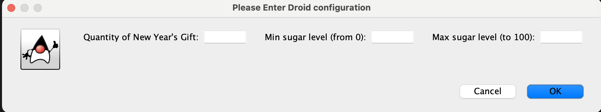

After cloning this repo you need to run from  NewYearGift directory one of Maven stages.
For example:

> mvn test

This creates target directory with compiled classes and project packaging.

Task content:

Create a console application that satisfies the following requirements:

    Use OOP : classes, inheritance , polymorphism , encapsulation .
    Every class must have a thorough sense of the name and information structure .
    Inheritance should be used only when it makes sense.
    When encoding to be used for forming agreements code java code convention.
    Classes must be correctly placed in the packages.
    Working with the console or console menu should be minimal.

To store the initialization parameters you can use files .

    Christmas gift:
    Define a hierarchy of chocolates and other sweets .
    Create multiple objects chocolates.
    Collect child gift with the definition of its weight.
    To sort the candies in the present on the basis of one of the parameters .
    Find candy in the present, corresponding to a predetermined range of the sugar content .

---

Run `com.epam.lab.view.Main` class.

You will open window like the following:

if you select Yes, you will see:

Output to console can be like:

New Year's Gift (list of contents):

#  Name                 Sugar     Weight
-  ----                 -----     ------
1  WhiteChocolate       23.30     194.80
2  Caramel              42.30     173.00
3  Waffles              53.10      51.40
4  Waffles              80.50     177.90
------
Total Weight                   597.10

========================================

New Year's Gift by sorted Weigh:

#  Name                 Sugar     Weight
-  ----                 -----     ------
1  Waffles              53.10      51.40
2  Caramel              42.30     173.00
3  Waffles              80.50     177.90
4  WhiteChocolate       23.30     194.80
------
Total Weight                   597.10

========================================

New Year's Gift by sorted Sugar level:

#  Name                 Sugar     Weight
-  ----                 -----     ------
1  WhiteChocolate       23.30     194.80
2  Caramel              42.30     173.00
3  Waffles              53.10      51.40
4  Waffles              80.50     177.90
------
Total Weight                   597.10

========================================

New Year's Gift with extracted sugar
(from 5.0 to 50.0):

#  Name                 Sugar     Weight
-  ----                 -----     ------
1  WhiteChocolate       23.30     194.80
2  Caramel              42.30     173.00
------
Total Weight                   367.80

========================================

Summary xml file will be generated at output folder.

There are a few samples which you can upload after suggestion as well.

